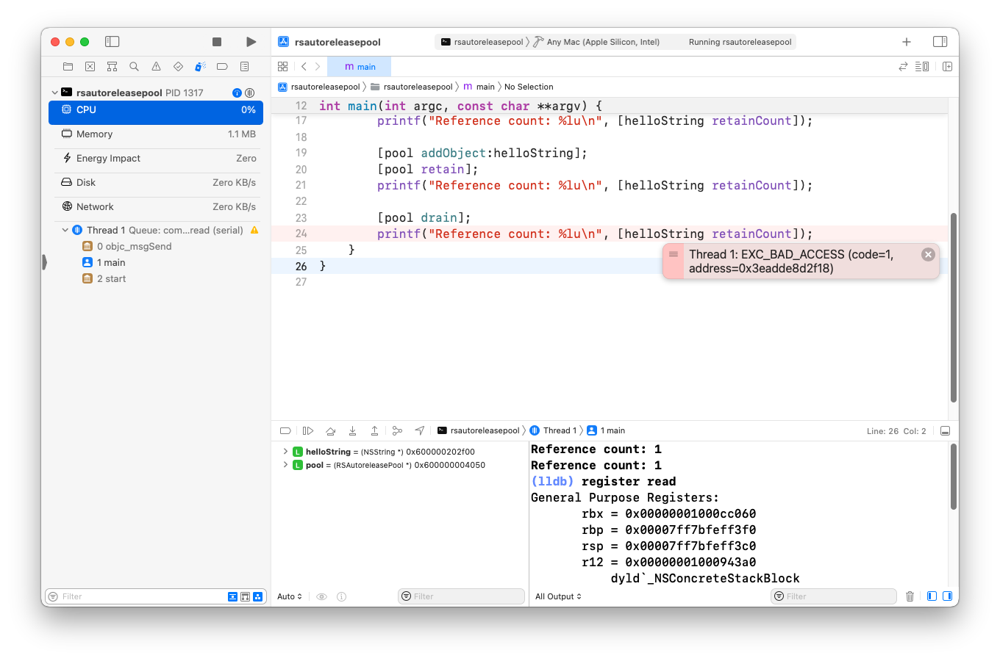

# RSAutoreleasePool

RSAutoreleasePool is an experimental implementation of Cocoa's [`NSAutoreleasePool`](https://developer.apple.com/documentation/foundation/nsautoreleasepool) class using CoreFoundation and the Objective-C runtime, inspired by [Mike Ash's blog post](https://www.mikeash.com/pyblog/friday-qa-2011-09-02-lets-build-nsautoreleasepool.html).

## How it works

RSAutoreleasePool uses CoreFoundation's `CFMutableArrayRef` to store a stack of autorelease pool instances. When an object is autoreleased, it is added to the topmost pool on the stack. When a pool is drained, all objects in that pool are sent a release message. Draining an autorelease pool removes it from the stack.

## Demo

Creating a new instance of the class:

```objc
RSAutoreleasePool *pool = [[RSAutoreleasePool alloc] init];
```

Object can be added to the pool using the addObject instance method:

```objc
[pool addObject:myObject];
```
When done with the pool, it can be drained:

```objc
[pool drain];
```

After the pool has been drained, any attempts to reference objects that were added to the pool results in a segmentation fault, as an exception is thrown.


>thread crashes with EXC_BAD_ACCESS (SIGSEGV)